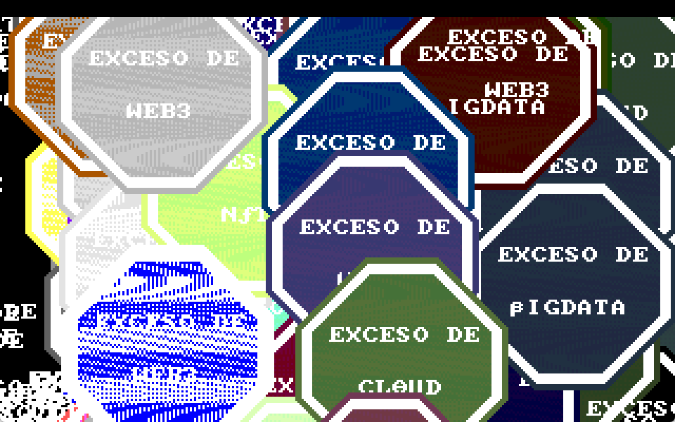

# XSO
FlashParty 2023 entry in the 256 byte intro category.

by gzalo (this was my first intro ever!)

- [Video of demo running](video.avi)
- [Binary](xso.com)
- [Source code](xso.asm)

Instructions
- Build using `nasm xso.asm -fbin -o xso.com`
- Run xso.com using DOSBox 0.74-3 (newest version), configured with cycles=10000 (or approx)
- The intro doesn't end, exit with ESC
